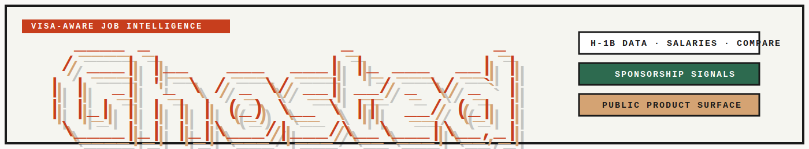
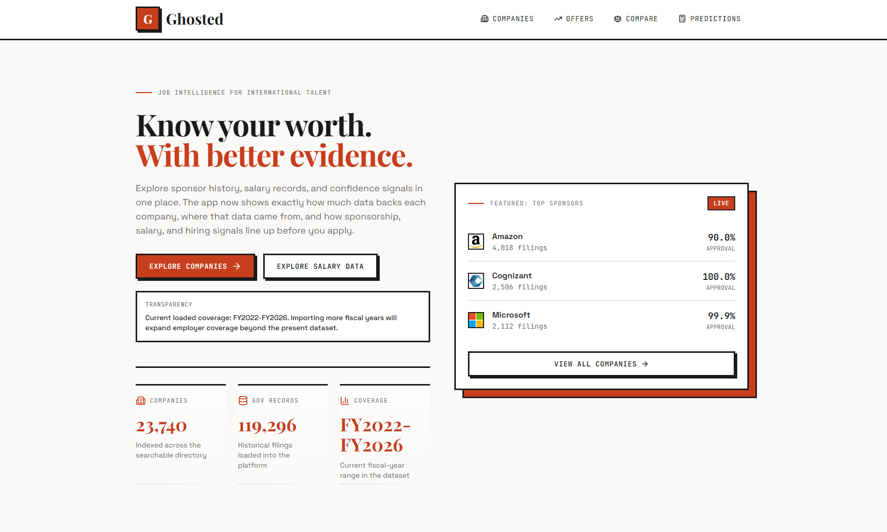

<h1 align="center">
  
</h1>

<p align="center">
  <a href="https://github.com/Yabuku-xD/Ghosted/releases"></a>
  <a href="LICENSE"></a>
  <a href="https://react.dev/"></a>
  <a href="https://www.djangoproject.com/"></a>
  <a href="https://docs.docker.com/compose/"></a>
</p>

Visa-aware job intelligence platform with H-1B data, salary insights, company comparison, and prediction tools.

Ghosted combines public H-1B/LCA data with salary records, company enrichment, and live hiring signals in a Dockerized full-stack app. The product is built around four public workflows: company discovery, salary intelligence, company comparison, and prediction tools for compensation and sponsorship odds.

Current tracked release: `v0.3.10`



## Table of Contents

- [Background](#background)
- [Install](#install)
- [Usage](#usage)
- [Configuration](#configuration)
- [Data Imports](#data-imports)
- [Repository Layout](#repository-layout)
- [Docs](#docs)
- [Contributing](#contributing)
- [License](#license)

## Background

Ghosted exists to answer a practical question for international candidates: which companies are likely to sponsor, how strong is the salary signal, and where are there active hiring opportunities right now?

The stack currently includes:

- Backend: Django, Django REST Framework, Celery, PostgreSQL, Redis
- Frontend: React, TypeScript, Vite, Tailwind CSS, React Query
- Infra: Docker Compose

Core product capabilities:

- Sponsorship-focused company discovery with visa-fair scoring
- Offer browsing with trust metadata and responsive pagination
- Domain and logo enrichment with graceful fallback rendering
- Live hiring signals from supported public ATS boards
- Side-by-side company comparison
- Salary prediction and sponsorship-odds tools

## Install

### Dependencies

For the default local setup, install:

- Docker Desktop with Docker Compose

For manual development instead of Docker, also install:

- Python 3.12+
- Node.js 20+
- npm

### Docker

```bash
docker compose up --build
```

This starts the frontend, backend API, database, cache, and supporting local services defined in [`docker-compose.yml`](docker-compose.yml).

### Manual Development

Backend:

```bash
cd backend
pip install -r requirements.txt
python manage.py migrate
python manage.py runserver
```

Frontend:

```bash
cd frontend
npm install
npm run dev
```

## Usage

Once the app is running, the public product surface centers on four areas:

- `Companies`: browse sponsorship-friendly employers, visa scores, trust signals, and company detail pages
- `Offers`: explore salary records with source metadata, filters, and pagination
- `Compare`: evaluate two companies side by side on sponsorship strength, salary coverage, and live jobs
- `Predictions`: estimate salary expectations and sponsorship odds from the currently available market data

Useful local verification commands:

```bash
docker compose exec frontend npm run build
docker compose exec backend python manage.py check
```

## Configuration

### Local Data

Raw source files are intentionally not committed. Put them in [`backend/data/`](backend/data/) and follow [`backend/data/README.md`](backend/data/README.md) when you want to seed or refresh local data.

### Branding And Logos

For fuller company-logo coverage, add a Logo.dev publishable key to `frontend/.env`:

```bash
VITE_LOGO_DEV_PUBLISHABLE_KEY=your_key_here
```

Without that key, the UI falls back to favicon-based branding when a known company domain is available.

## Data Imports

Run import and enrichment commands from `backend/`:

```bash
python manage.py import_h1b_directory ./data --skip-existing --recalculate-scores
python manage.py enrich_company_branding --limit 10000
python manage.py import_greenhouse_jobs --limit 10
```

These commands are useful when you want to:

- load multiple DOL disclosure files
- enrich company domains and branding metadata
- import live jobs from supported public ATS boards

## Repository Layout

```text
ghosted/
├── backend/                  # Django apps, API, import commands, services
├── frontend/                 # React application
├── docs/                     # Plans, status notes, verification assets
├── CHANGELOG.md              # Release notes
├── LICENSE                   # MIT license
└── docker-compose.yml        # Local multi-service setup
```

## Docs

- [Changelog](CHANGELOG.md)
- [Plans](docs/plans/)
- [Status Notes](docs/status/)
- [Verification Assets](docs/verification/)

## Contributing

Issues and focused pull requests are welcome. When proposing a change:

- keep the README and changelog aligned with the actual code changes
- include the relevant verification steps or results
- avoid documenting features that are not implemented yet

## License

This project is licensed under the MIT License. See [LICENSE](LICENSE).
